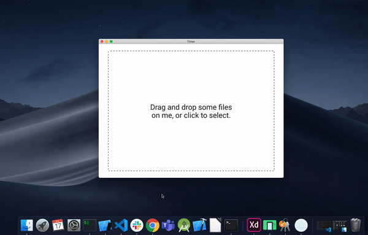

### Getting started

`npm install`

Start dev server:

`npm start`

In a new terminal window:

`npm run electron`

Here is a demo gif of how the app should look once you successfully clone it and run.

  

