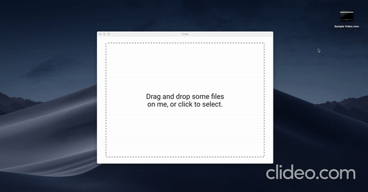

## Getting started

<b>Note: Make sure to install ffmpeg and ffprobe in your machine before using this app</b>
  

You can download the executables from https://ffmpeg.org/download.html
  

## Project Setup

 

- <code>git clone https://github.com/dineshnadimpalli/Video-Converter.git</code>
- <code>cd Video-Converter</code>
- <code>npm install</code>

Start react dev server:

- <code>npm start</code>

In a new terminal window run electron app:

- <code>npm run electron</code>
